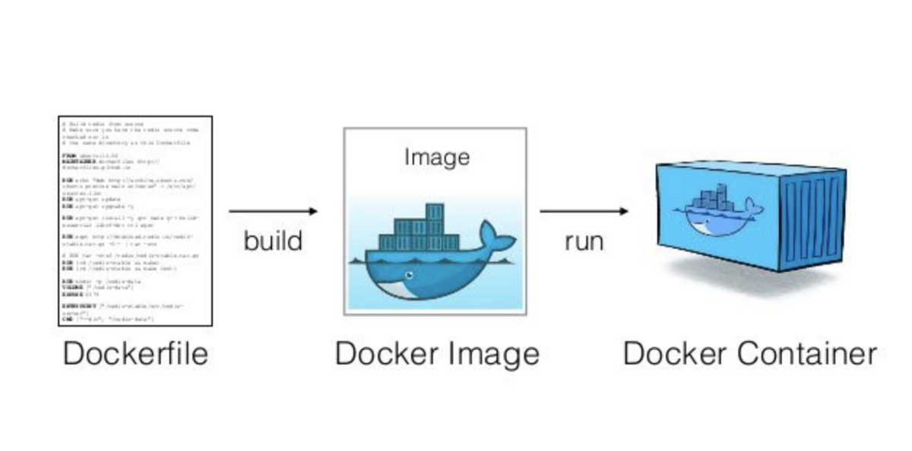

# hello
# Docker
Data Virtualization with GenAI

## class 2 data type
*image

*text

## create docker image with "Dockerfile"

'''
#after : add the tag number
FROM python:3.12-slim

#create new app folder in linux image
WORKDIR /app

#copy from base OS to  linux image. (1st . is source and other . is destination) copying to app folder that is in container
COPY . ./app

#run python file code
CMD pyhton ./app/mycode.py

#create docker image 
docker build -t <my-dev-image> .

#optional command if you want to create image with any specif enviornment like dev, text, staging. use below command 
docker build -f Dockerfile.dev -t my-dev-image .
'''

